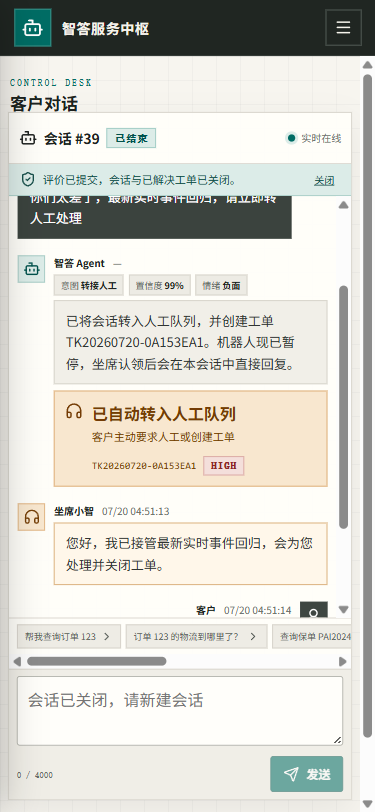
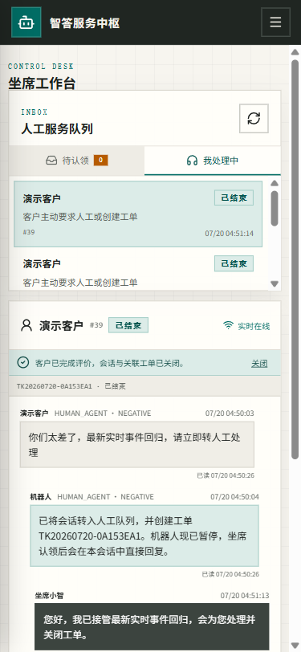
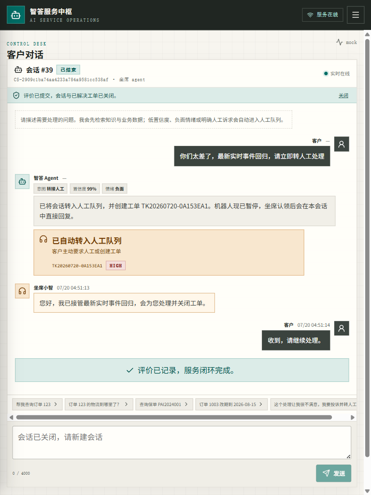
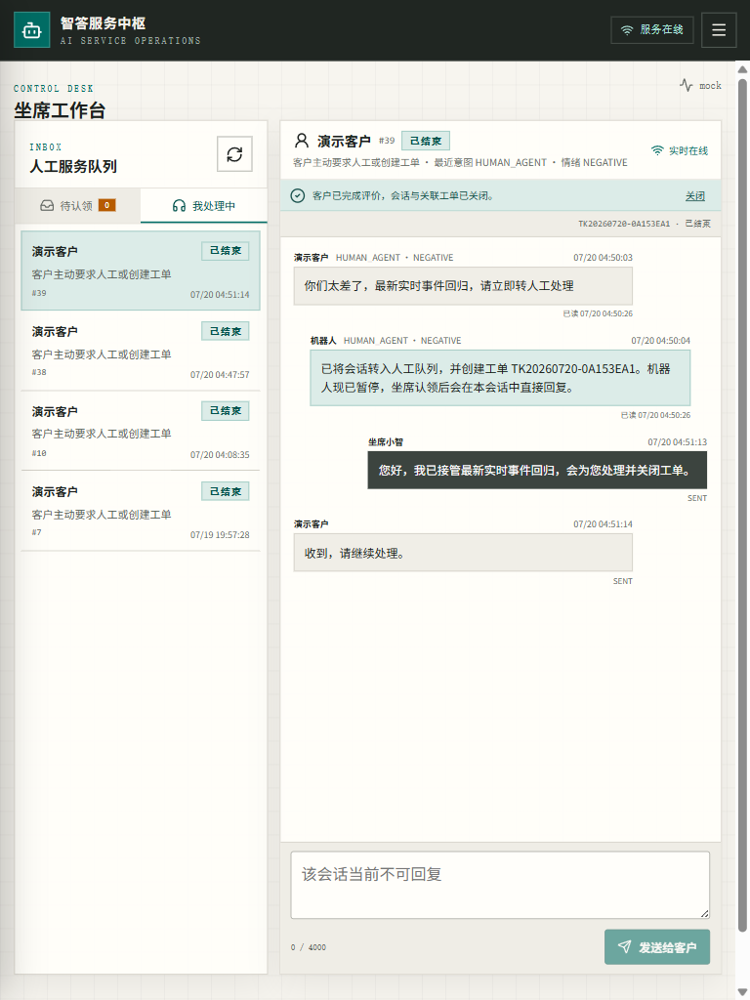

# AI Service Agent 验收证据

## 结论

`v1.0.0` 发布候选版已在 2026-07-20（Asia/Shanghai）完成统一标准与专项标准验收。零密钥 Demo 的客户对话、知识检索、工具调用、自动转人工、坐席双向接管、工单/SLA、RBAC、审计、实时事件、运营看板和评价关闭形成真实可运行闭环。

当前未发现 P0/P1 或核心流程可复现 P2 缺陷。Mock LLM 与 Mock 业务 adapter 在健康接口、登录页、全局顶栏、工具结果和文档中均明确标识；本地知识检索不是固定答案替身。没有真实外部凭据，因此外部 LLM/业务系统只验收契约、配置门禁和失败行为，不声称其线上质量已经通过。

## 验收环境与边界

| 项目 | 实测环境 |
| --- | --- |
| OS | Windows 11 |
| Java / Maven | Java 21.0.8（目标字节码 17）、Maven 3.9.11 |
| Node.js | 22.22，npm/npx 10.9.4 |
| 容器 | Docker Engine 29.6.1、Compose v2、MySQL 8、Nginx 1.27 |
| 运行端口 | 后端 `19040`、前端 `19041`、MySQL `19042`；无范围外项目服务 |
| Demo adapter | Mock LLM、Mock 业务 adapter、本地真实词法知识检索 |
| 时区 | 应用、JSON 与 MySQL 均为 `Asia/Shanghai` |

## 全项目统一完成标准

| 标准 | 结果 | 主要证据 |
| --- | --- | --- |
| 功能完整 | PASS | 自动验收覆盖订单工具、知识来源、低置信度/负面转人工、认领、双向消息、解决、评价关闭；取消、重放、403、无答案和重复操作另有测试 |
| 页面样式 | PASS | 客户、坐席、工单、知识、审计和看板使用统一工作台设计；三类视口逐页检查；截图来自真实运行数据 |
| 交互体验 | PASS | SSE 可停止，WebSocket 自动重连与 `afterId` 补放，表单前后端校验，按钮提交锁，错误/空/离线/权限状态，敏感改期二次确认 |
| 性能 | PASS | 普通读 p95 250.57 ms，核心写 p95 554.01 ms，业务错误率 0；桌面 Lighthouse 97/100/100 |
| 质量 | PASS | 后端 40/40；前端 lint/typecheck/Vitest 8/8/build；完整 E2E、Compose、MySQL、secret scan、依赖审计与差异检查通过 |
| 开箱启动 | PASS | `.env.example` 零密钥可用；Compose 自动建表/seed/健康等待；固定入口、账号、演示步骤和非零失败自动验收脚本齐全 |
| 完成证据 | PASS | 本文件、真实截图、[性能报告](PERFORMANCE_REPORT.md)、[维度审计](docs/DIMENSION-AUDIT.md)、测试结果与可解释 Git 状态齐全 |

## AI Service Agent 专项标准

| # | 必须完成项 | 结果与证据 |
| ---: | --- | --- |
| 1 | 四角色认证、RBAC、资源隔离 | 持久化 `customer/agent/supervisor/admin`；后端方法/资源授权；401/403、客户/坐席 ID 枚举、看板权限和 Cookie CSRF 测试通过 |
| 2 | 有来源的真实知识检索 | 文档入库、确定性分块、租户隔离检索、归档、阈值无答案、来源 `KB-1-1`；失败转人工，不伪造答案 |
| 3 | 意图/情绪、置信度与降级 | 规则分类是确定性兜底；38 条固定评估全部通过；低置信度、负面情绪和明确人工诉求进入人工队列 |
| 4 | 人工接管 | 持久队列、数据库原子认领、客户/坐席双向消息、消息幂等、已读、机器人暂停/恢复、完整时间线与断线补放 |
| 5 | 工单和 SLA | 随机外部编号、创建幂等、乐观锁、指派、合法状态机、重开、关闭原因；SLA 预警/升级使用条件更新与唯一事件键，多实例不重复 |
| 6 | 业务工具与 adapter | 6 个 JSON Schema 工具具备参数校验、权限、租户边界、超时、有限重试、幂等和审计；Mock/HTTP adapter 共用契约并显示来源 |
| 7 | Agent 防护 | 最大工具轮次、循环检测、Prompt 注入隔离、PII 脱敏、失败回退；改期先生成待确认执行单，确认后才原子执行 |
| 8 | 可信运营看板 | 指定日期范围内由真实会话、消息、工单、SLA 与评价计算会话量、首次响应、解决率、转人工率、超时率、满意度和趋势 |
| 9 | 固定评估集 | 38 条，覆盖工具选择、参数、多轮、知识、负面、无答案、越权、重复提交、恶意 Prompt；整体准确率与转人工召回均 100%，失败分类为空 |
| 10 | 完整页面与零密钥演示 | 客户对话、坐席工作台、工单、知识、审计、看板及 loading/empty/error/offline/permission；Compose Demo 和真实截图可复验 |

## 自动化测试

| 命令 | 真实结果 |
| --- | --- |
| `cd backend && mvn test` | **40 tests**，0 failure，0 error，0 skipped；BUILD SUCCESS；1m31s |
| Agent 固定评估（包含在 Maven） | **38/38**；整体准确率 100%；转人工召回 100%；工具/参数/多轮/知识/安全/越权/幂等维度均 100% |
| `cd frontend && npm run check` | ESLint 0 warning；TypeScript 通过；Vitest **8/8**；Vite production build 通过 |
| `NODE_TLS_REJECT_UNAUTHORIZED=1 npm audit --audit-level=high` | 0 vulnerabilities |
| `node scripts/quality-gates.mjs` | **219** 个可提交文本文件通过；高风险密钥特征、遗留服务端口与旧 WebSocket 路径均为 0 |
| `git diff --check` | 通过，无空白错误 |

后端回归包含：adapter 合同/缺配置失败、知识来源与无答案、Prompt 注入、工具选择和 SSE 取消；RBAC/ID 枚举/CSRF/异常脱敏；敏感确认归属与重放；并发建单、并发认领、SLA 多实例幂等；实时事件受众隔离与 `afterId` 重放；工单状态机。

## Docker、MySQL 与开箱启动

执行过全新数据卷启动、镜像重建、自动验收、全栈重启和持久化核对：

```bash
docker compose down -v
docker compose up -d --build --wait --wait-timeout 240
node scripts/acceptance-smoke.mjs
docker compose restart
docker compose up -d --wait --wait-timeout 240
```

- 全新 MySQL：15 张表、4 个 Demo 用户、5 个知识文档、3 个 seed 工单、0 个工具执行单；DDL 任一错误会阻止 readiness。
- 后端与前端均完成无缓存镜像构建；当前运行镜像分别为 `sha256:840424a19b33...` 与 `sha256:eb3a5df143f0...`，三容器均为 healthy。
- 自动验收首轮 PASS：会话 #3、工单 `TK20260720-E01C1DB0`；当前无缓存镜像最终复验 PASS：会话 #13、工单 `TK20260720-B7B6EDFC`。
- 当前持久化计数为 15 表、4 用户、5 知识文档、8 工单、13 会话、5 评价、6 工具执行单，`innodb_flush_log_at_trx_commit=1`；全栈重启验证过 seed 不重复。
- 匿名 `/api/health` 与 `/api/ready` 均返回成功；readiness 明确报告 database/business adapter 状态。
- Nginx 配置检查通过；`index.html` 不缓存，哈希资源一年 immutable，并返回 nosniff、frame deny、no-referrer。
- 最新十分钟后端/前端日志未发现 `ERROR`、异常或无意义告警。

自动脚本 [scripts/acceptance-smoke.mjs](scripts/acceptance-smoke.mjs) 会校验健康和 adapter 来源、RBAC 403、订单工具、知识引用、自动转人工、队列认领、双向消息、消息幂等、工单解决和评价关闭；任一步失败都会非零退出。

原生链路也使用同一脚本复验：H2 后端临时运行于 `19043`，Vite 临时运行于 `19044`；readiness 为 READY、页面 200 且挂载节点存在，自动验收 PASS（会话 #3、工单 `TK20260720-8FA47FB4`）。验证后两项临时服务已停止，仅 Compose 的 `19040–19042` 保持监听。

## 真实浏览器核心 E2E

最终复验使用两个相互隔离的有界面 Chromium 会话，客户和坐席同时连接 Compose/MySQL 运行实例。完整链路发生在同一会话 **#7**，关联工单 **`TK20260720-33A16047`**：

1. 客户新建会话并点击“帮我查询订单 123”；Agent 选择 `query_order`，返回脱敏地址和显式 `mock` 来源。
2. 同一会话发送投诉并要求人工；意图 `HUMAN_AGENT` 99%、情绪 `NEGATIVE`，创建一个 URGENT 工单并暂停机器人。
3. 坐席工作台出现实时队列项；认领成功后工单进入处理中，客户无需刷新即收到“坐席已接管”。
4. 坐席发消息，客户实时收到；客户回复，坐席实时收到并显示完整历史/已读状态。
5. 坐席将工单标记已解决；客户实时出现评价入口，提交 5 星后会话与工单同时关闭。
6. 客户、坐席最终页面均显示已结束/已关闭，回复输入禁用；两个浏览器控制台均为 **0 errors、0 warnings**。

| 客户最终态 | 坐席最终态 |
| --- | --- |
|  |  |

## 响应式、管理页与性能证据

- 真实浏览器检查 `375×812`、`768×1024`、`1440×900`；客户和坐席页面 `document.scrollWidth === innerWidth`，无全局横向滚动、遮挡或不可达核心操作。
- 登录、客户、坐席、工单、主管看板/审计和管理员知识页均使用真实运行数据，不是静态占位图。
- Lighthouse 原始 JSON：`docs/lighthouse-login.json`、`docs/lighthouse-login-after.json`、`docs/lighthouse-login-desktop.json`。
- 完整性能数据、基线/优化对比和复现命令见 [PERFORMANCE_REPORT.md](PERFORMANCE_REPORT.md)。

| 375 客户 | 375 坐席 | 768 客户 | 768 坐席 |
| --- | --- | --- | --- |
|  |  |  |  |

管理证据：

- [主管看板](docs/screenshots/e2e-supervisor-dashboard.png)
- [主管工单](docs/screenshots/e2e-supervisor-tickets.png)
- [主管脱敏审计](docs/screenshots/e2e-supervisor-audit.png)
- [管理员知识维护](docs/screenshots/e2e-admin-knowledge.png)

## 敏感操作、安全与并发证据

- 改期确认前业务 adapter 无副作用；首次确认只执行一次并创建一个工单；重复确认返回同一结果。请求/执行各有审计记录，客户不能确认他人的执行单。
- 同一幂等键或同一 chat `clientMessageId` 重放不重复调用工具、建单或发送人工消息。
- 并发创建同一工单只得到一个结果；两个坐席并发认领只有一个成功；两个 SLA 扫描实例只产生一次预警/升级。
- Cookie 模式使用 HttpOnly + SameSite=Strict + CSRF；Bearer 模式不依赖 Cookie CSRF。审计对 password/token/API key/地址递归脱敏。
- 真实 HTTP adapter fake server 合同验证了认证头、租户参数、超时、重试和幂等键；真实配置缺失会启动失败。LLM 私网地址默认拒绝。

## 已知边界与外部验收项

这些边界不是当前发布候选版的已知严重缺陷：

- 没有提供真实 LLM key 或真实业务系统地址/令牌，因此没有伪造外部供应商成功、质量或延迟。上线方需在批准的测试环境执行真实 adapter smoke。
- 本次验证的是全新 v1 schema。既有旧数据库升级必须先备份，并按实际旧 schema 提供审核后的迁移脚本；不能把 `IF NOT EXISTS` 当列迁移工具。
- 生产边缘速率限制、TLS 终止和集中密钥管理属于部署平台职责；应用已提供认证、租户/资源授权、超时、请求限制和生产配置门禁。
- 移动模拟 Lighthouse Performance 为 73；该结果与共享主机 CPU 争用一起保留。桌面客服工具场景为 97，实际手机/平板交互与布局已逐页通过。

## Git 状态

- 工作树改动均属于本次任务，范围限定在 `D:\project-hub\ai-service-agent`；历史基线开始时工作树为空。
- 生成的 Maven/npm/Vite/Playwright 临时产物不纳入交付；保留的截图和 Lighthouse JSON 是明确验收证据。
- 未执行 commit、push 或发布。
