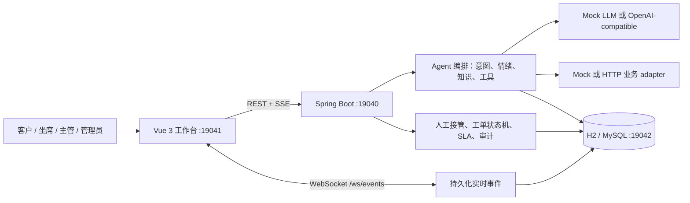
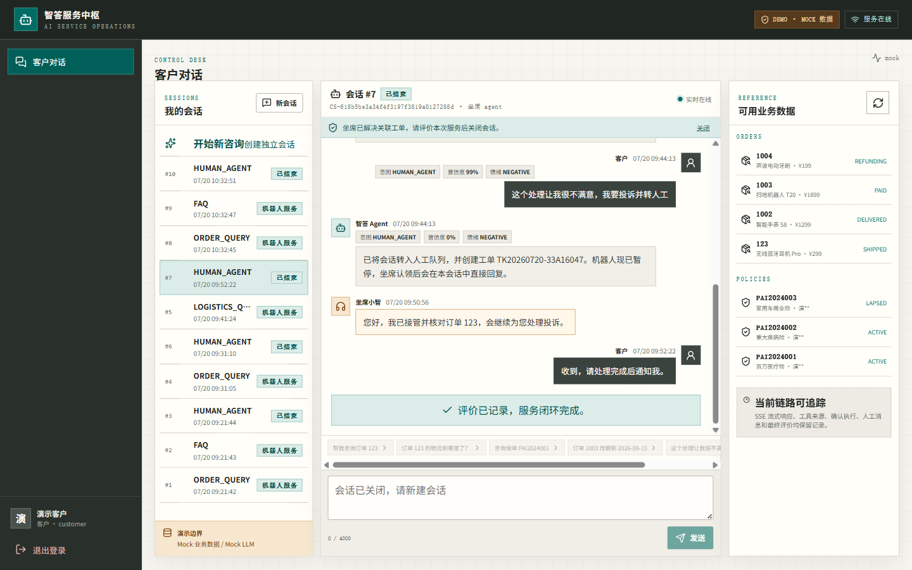
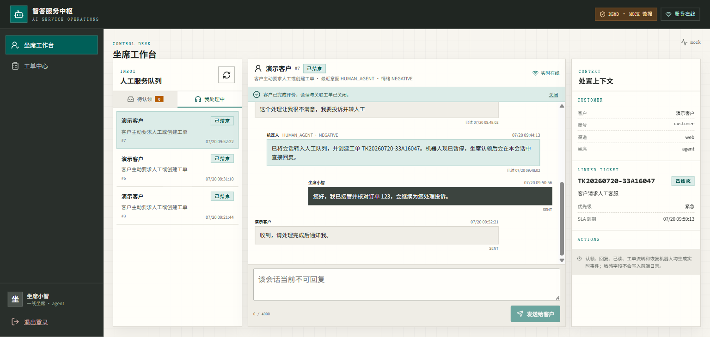
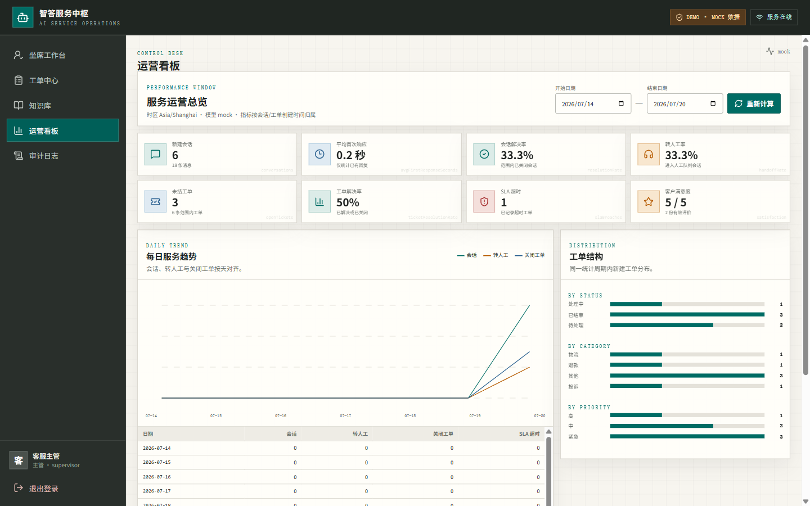

# 智答 · AI Service Agent

面向电商与保险售后的客服 Agent v1 发布候选版。客户可查询订单、物流、保单与知识库，发起工单或需确认的改期；低置信度、负面情绪和明确转人工会进入队列。坐席可实时认领并双向接管，直至工单解决、客户评价和会话关闭。

默认零密钥 Demo 明确使用 Mock LLM 与 Mock 业务 adapter；真实 LLM、真实业务 adapter 与 Mock 共用契约，缺少真实配置时会启动失败，不会静默降级。

## 已完成能力

| 范围 | 当前实现 |
| --- | --- |
| 客户对话 | 登录、SSE 流式消息、刷新恢复、错误/重试、工具过程、数据源标识、知识来源、满意度 |
| 知识检索 | 文档入库、确定性分块、租户隔离检索、置信阈值、无答案转人工、来源引用、归档 |
| Agent | 规则意图/情绪兜底、置信度、38 条固定评估集、Prompt 注入隔离、最大工具轮次、取消 |
| 业务工具 | 6 个 JSON Schema 工具；参数、资源归属、权限、超时、幂等、审计与 adapter 来源 |
| 敏感操作 | 改期先生成 `PENDING_CONFIRMATION` 执行单；确认后原子执行；重复确认重放同一结果 |
| 人工接管 | 转接队列、原子认领、客户/坐席双向消息、消息幂等、已读、机器人暂停与恢复 |
| 工单 | 随机外部编号、创建幂等、乐观锁、合法状态机、指派、重开、关闭原因、完整时间线 |
| SLA | 分优先级截止时间、预警、超时升级；数据库条件更新和唯一事件保证多实例不重复 |
| 权限与审计 | `customer/agent/supervisor/admin` 四角色；后端 RBAC、资源隔离、ID 枚举防护、脱敏审计 |
| 实时与看板 | 持久化 WebSocket 事件、受众隔离、`afterId` 重放；真实事件计算运营指标与趋势 |
| 前端 | 客户对话、坐席工作台、工单、知识、审计、看板；桌面/平板/手机响应式完整状态 |

## 架构与边界



- WebSocket 只发送可重放事件；业务写入始终走带鉴权和幂等保护的 REST。
- `local-lexical` 是真实本地知识检索实现，不标记为 Mock；Demo 中只有 LLM 与业务 adapter 为 Mock。
- `APP_DEMO_ENABLED=false` 会启用生产配置门禁：禁止 Mock、匿名对话、开发 JWT 密钥、通配 CORS 和非 MySQL 配置。

设计细节见 [架构说明](docs/architecture.md)，权限矩阵见 [RBAC 与资源隔离](docs/RBAC-ROADMAP.md)。

## 一条命令启动

支持：Docker Desktop / Docker Engine 24+、Compose v2；建议 4 核 CPU、6 GB 可用内存、4 GB 可用磁盘。已在 Windows 11 + Docker Desktop 验证；Compose 路径同时适用于 Linux/macOS。

```bash
# Windows cmd
copy .env.example .env

# Linux / macOS
cp .env.example .env

docker compose up -d --build --wait --wait-timeout 240
```

如果 Maven Central 在 Docker 内不可达，可临时在 `.env` 设置可信镜像：

```env
MAVEN_MIRROR_URL=https://maven.aliyun.com/repository/public
```

固定入口：

| 服务 | 地址 |
| --- | --- |
| 前端 | <http://127.0.0.1:19041> |
| 后端健康 | <http://127.0.0.1:19040/api/health> |
| MySQL | `127.0.0.1:19042` |

Demo 账号均为虚构数据：

| 角色 | 用户名 | 密码 | 默认入口 |
| --- | --- | --- | --- |
| 客户 | `customer` | `customer123` | 客户对话 |
| 坐席 | `agent` | `agent123` | 坐席工作台 |
| 主管 | `supervisor` | `super123` | 看板、工单、审计、知识只读 |
| 管理员 | `admin` | `admin123` | 全部管理能力 |

启动后运行自动验收：

```bash
node scripts/acceptance-smoke.mjs
```

脚本失败会非零退出，覆盖健康与 adapter 来源、RBAC 403、订单工具、知识引用、自动转人工、队列认领、双向消息、消息幂等、工单解决和评价关闭。

## 3–5 分钟演示

1. 用客户账号提问 `帮我查订单123`，确认出现 `query_order`、脱敏地址和 `mock` 来源。
2. 提问 `退货需要满足什么条件？`，确认答案展示 `KB-1-1` 来源。
3. 提问 `请把订单1003的配送改期到2026-07-28`；取消确认不会产生副作用，确认后生成一个跟进工单，重复确认只重放。
4. 输入 `你们太差了，我要投诉并转人工！`；保持客户页面，另开窗口登录坐席账号。
5. 坐席从队列认领并回复，客户实时收到；坐席解决工单，客户提交评分后会话与工单关闭。
6. 登录主管账号查看真实看板、工单时间线与脱敏审计。

完整话术和状态说明见 [使用指南](docs/USAGE.md)。

## Mock 与真实 adapter

| 配置 | Demo | 真实模式 |
| --- | --- | --- |
| LLM | `LLM_PROVIDER=mock`，确定性离线替身 | `LLM_PROVIDER=openai` + `LLM_API_KEY/BASE_URL/MODEL` |
| 业务系统 | `BUSINESS_ADAPTER=mock`，仅虚构订单/物流/保单 | `BUSINESS_ADAPTER=http` + `BUSINESS_BASE_URL/API_TOKEN` |
| 知识 | `local-lexical`，本地真实入库/分块/检索 | 当前同一实现，可替换但必须保持来源与租户契约 |

真实 provider 或 adapter 缺少必需配置会终止启动；真实 LLM 私网地址默认禁止，只有明确设置 `LLM_ALLOW_PRIVATE_BASE_URL=true` 才允许。

## 本地开发

要求 JDK 17+、Maven 3.9+、Node.js 22；仅使用 `19040–19049` 端口。

```bash
cd backend
mvn spring-boot:run

cd ../frontend
npm ci
npm run dev
```

默认后端是 H2 内存库 + Demo seed + Mock adapters；前端固定 `19041` 并代理到 `19040`。

## 验证

```bash
cd backend
mvn test

cd ../frontend
npm run check

cd ..
node scripts/acceptance-smoke.mjs
node scripts/quality-gates.mjs
git diff --check
```

- 后端包含 RBAC/ID 枚举、并发建单、并发认领、SLA 多实例、知识、Prompt 注入、敏感确认、adapter 契约、实时重放与 SSE 取消回归。
- 前端 `check` 串行执行 lint、typecheck、Vitest 和生产构建。
- CI 在全新 checkout 上执行 secret/旧端口门禁、后端、前端、Compose/MySQL schema、核心验收和三组 k6。
- 完整结果与浏览器证据见 [验收证据](ACCEPTANCE_EVIDENCE.md) 和 [性能报告](PERFORMANCE_REPORT.md)。

## API 分组

| 分组 | 主要路径 |
| --- | --- |
| 认证 | `/api/auth/login`、`/me`、`/session`、`/csrf`、`/logout` |
| 对话 | `POST /api/chat`、`/api/conversations/**` |
| 执行单 | `/api/tool-executions`、`/{id}/confirm` |
| 工单 | `/api/tickets`、`/{id}/claim`、`/assign`、`/transition`、`/reopen` |
| 知识 | `/api/knowledge/documents`、`/search` |
| 运营 | `/api/dashboard/overview`、`/api/audit` |
| 实时 | `/ws/events`、`GET /api/events?afterId=` |

所有业务响应含 `requestId`；401/403/404/409/422/500 使用真实 HTTP 状态。SSE 错误以对应 HTTP 状态和 `event:error` 返回。

## 界面证据

| 客户闭环 | 坐席闭环 | 主管看板 |
| --- | --- | --- |
|  |  |  |

移动端和管理页截图见 [验收证据](ACCEPTANCE_EVIDENCE.md)。截图来自真实运行页面，不是占位图。

## 文档

- [使用与故障排查](docs/USAGE.md)
- [架构与关键时序](docs/architecture.md)
- [部署与生产门禁](DEPLOYMENT.md)
- [安全策略](SECURITY.md)
- [性能报告](PERFORMANCE_REPORT.md)
- [完成态审计](docs/DIMENSION-AUDIT.md)
- [变更记录](CHANGELOG.md)

## 许可证

本项目使用 [MIT License](LICENSE)。仓库中的账号、订单、地址、保单、工单和截图数据均为虚构演示数据，不含真实密钥或个人信息。
