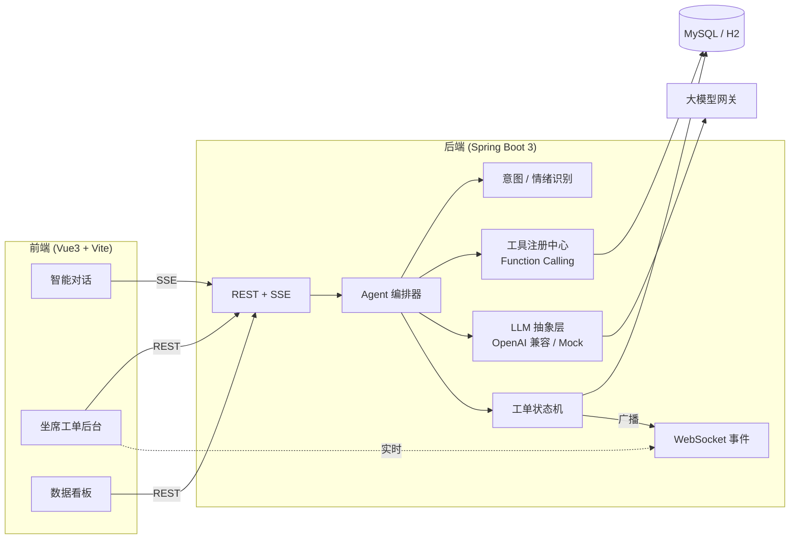
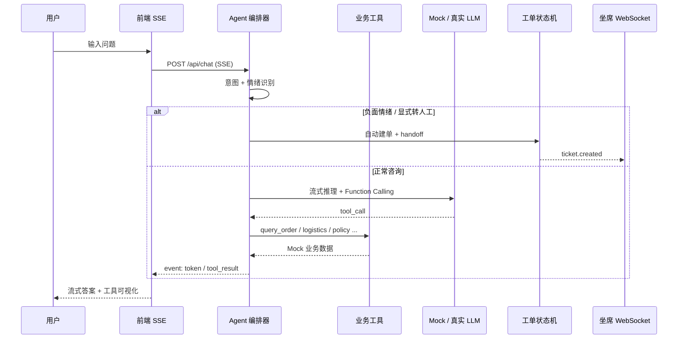
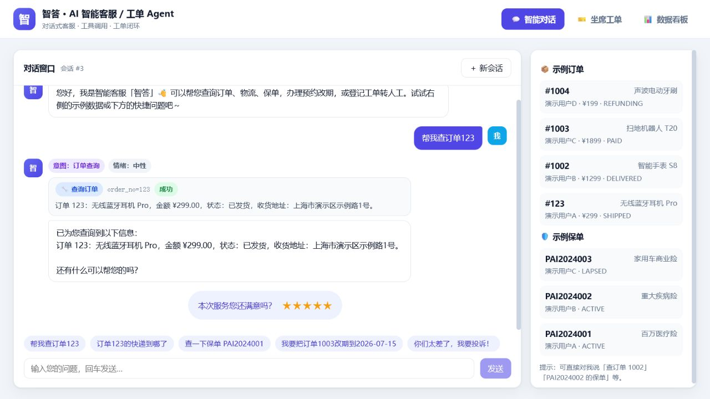
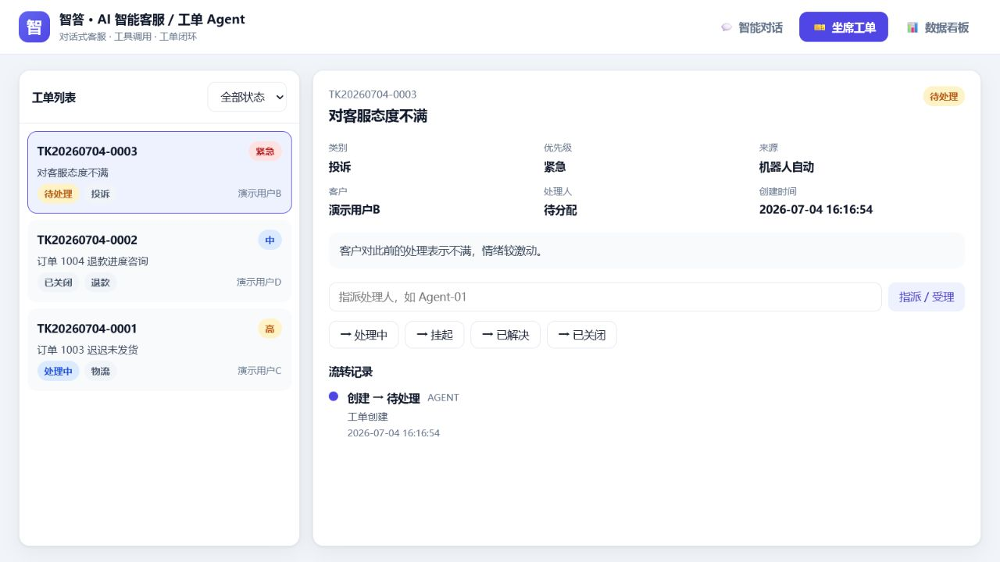
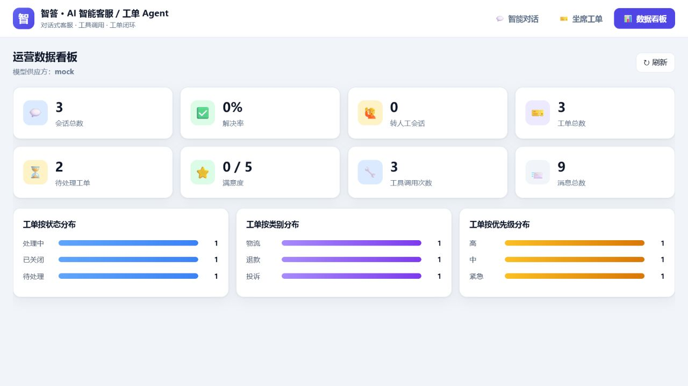

# 智答 · AI 智能客服 / 工单 Agent 系统

> 面向电商 + 保险场景的**对话式智能客服系统**：多轮对话结合知识库问答、**Agent 工具调用（Function Calling）**打通订单/物流/保单/工单/预约改期等真实业务，**意图 + 情绪识别**驱动**自动升级转人工**与**工单闭环**，SSE 流式输出、坐席实时后台、运营数据看板一应俱全。一条 `docker compose` 命令即可拉起，**无需任何大模型密钥**也能完整体验。

<p>
  
  
  
  
  
  
  
</p>

---

## ✨ 项目亮点

- **垂直客服 Agent，而非通用助手**：围绕真实售后场景设计——查订单、查物流、查保单、创建/查询工单、预约改期，每个能力都是可被大模型自主调用的 **Function Calling 工具**，对接内置 Mock 业务库返回真实数据，杜绝“一本正经地胡说”。
- **意图识别 + 情绪识别双引擎**：轻量规则模型实时判定用户意图与情绪极性；识别到**负面情绪自动升级**（创建高优先级工单并转接人工），也支持用户显式「转人工」。
- **工单全生命周期闭环**：自动分类 / 定优先级 / 建单，内置**状态机**保证 `OPEN → IN_PROGRESS → PENDING → RESOLVED → CLOSED` 合法流转，全程留痕；坐席后台可指派、流转、查看时间线。
- **SSE 流式对话 + 工具调用可视化**：前端逐 token 呈现回答，并实时展示「调用了哪个工具、传了什么参数、返回了什么」，Agent 决策过程透明可观测。
- **坐席实时后台（WebSocket）**：机器人自动建单 / 转人工的那一刻，坐席端即时收到推送，无需刷新。
- **可插拔多模型供应方**：`OpenAI / DeepSeek / 通义千问 / 本地 Ollama` 等任意 OpenAI 兼容网关，环境变量一键切换，密钥仅走 `.env`；**未配置密钥时自动回退内置 Mock 模型**，离线可跑、可测。
- **零依赖本地体验**：默认内存 H2（MySQL 兼容模式）+ Mock 模型，`mvn spring-boot:run` 即起；生产用 MySQL，`docker compose` 一键部署。
- **工程化**：清晰分层（controller / service / agent / llm / mapper），JUnit 单测覆盖**意图识别、工具路由、工单状态机**，全链路（Mock）集成测试开箱即过。

## 🏗️ 系统架构



> 更完整的时序图、转人工逻辑与状态机见 [`docs/architecture.md`](docs/architecture.md)。

## 🧰 技术栈

| 层 | 选型 |
| --- | --- |
| 后端 | Java 17、Spring Boot 3.5、Spring MVC（SSE）、Spring WebSocket |
| 持久层 | MyBatis-Plus 3.5、MySQL 8（生产）/ H2 MySQL 模式（本地&测试） |
| Agent | 自研工具注册中心 + Function Calling 编排、规则版意图/情绪识别 |
| 大模型 | OpenAI 兼容客户端（JDK HttpClient，流式 + 工具调用）/ 内置 Mock |
| 前端 | Vue 3、Vite、TypeScript、Vue Router、原生 Fetch SSE、WebSocket |
| 部署 | Docker、docker-compose、Nginx |
| 测试 | JUnit 5、Spring Boot Test |

## 📁 目录结构

```
ai-service-agent/
├─ backend/                          # Spring Boot 3 后端
│  ├─ src/main/java/com/portfolio/csagent/
│  │  ├─ agent/          # Agent 编排：意图/情绪/工具/编排器
│  │  │  └─ tool/        # 工具注册中心 + 6 个业务工具
│  │  ├─ llm/            # LLM 抽象层：OpenAI 兼容 + Mock
│  │  ├─ service/        # 会话/对话SSE/工单状态机/看板/示例数据
│  │  ├─ controller/     # REST + SSE 接口
│  │  ├─ ws/             # 坐席事件 WebSocket
│  │  ├─ entity / mapper # MyBatis-Plus 实体与 Mapper
│  │  ├─ dto / common / config
│  ├─ src/main/resources/
│  │  ├─ application.yml           # 默认 H2 + Mock
│  │  ├─ application-mysql.yml     # MySQL Profile
│  │  └─ schema.sql                # 建表（兼容 H2/MySQL）
│  ├─ src/test/java/...            # 意图/工具路由/状态机 单测
│  └─ Dockerfile
├─ frontend/                         # Vue3 + Vite 前端
│  ├─ src/views/                     # 对话 / 工单后台 / 数据看板
│  ├─ src/api.ts                     # REST + SSE + WebSocket 封装
│  ├─ nginx.conf                     # 反代 /api、/ws（SSE 关闭缓冲）
│  └─ Dockerfile
├─ docs/                             # 架构文档与截图
├─ DEPLOYMENT.md       # 部署说明
├─ SECURITY.md         # 安全策略与漏洞报告
├─ PERFORMANCE_REPORT.md
├─ performance/        # k6 压测脚本
├─ docker-compose.yml
├─ .env.example
└─ README.md
```

## 🚀 快速开始

### 方式一：Docker 一键启动（推荐）

```bash
cd ai-service-agent
cp .env.example .env        # 可选：默认 Mock 模型即可体验；要接真实大模型再填 LLM_API_KEY
docker compose up -d --build
```

启动后：

- 前端界面： http://localhost:8080
- 后端接口： http://localhost:8081/api/health
- MySQL：容器内自动初始化库表与**示例数据**

如果本机 8080 / 8081 已被占用，可在 `.env` 中覆盖宿主机端口后再启动：

```bash
FRONTEND_HOST_PORT=18082
BACKEND_HOST_PORT=18083
docker compose up -d --build
```

打开前端后可直接体验：

1. 在「智能对话」输入 `帮我查订单123` → 观察 Agent 调用 `query_order` 工具并流式回答；
2. 输入 `订单123的快递到哪了` → 触发物流查询；
3. 输入 `你们太差了，我要投诉！` → 情绪识别为负面，**自动建单并转人工**；
4. 切到「坐席工单」实时看到新工单，可指派、流转状态；
5. 切到「数据看板」查看会话量、解决率、工单分布等。

### Mock 零密钥演示（无需 API Key）

| 配置项 | 默认值 | 说明 |
| --- | --- | --- |
| `LLM_PROVIDER` | `mock` | 内置离线模型，Compose 已注入 |
| `LLM_API_KEY` | *(空)* | 留空即可；未配置时即使设为 `openai` 也会安全回退 Mock |
| 数据库 | MySQL 容器 | Compose 自动初始化示例订单/保单/工单 |

详细话术与验证步骤见 [docs/USAGE.md](docs/USAGE.md)。

### 核心流程：对话 → 工具 → 工单



### 方式二：本地开发（零外部依赖）

后端（默认内存 H2 + Mock 模型，无需数据库与密钥）：

```bash
cd backend
mvn spring-boot:run
# 接口： http://localhost:8080/api/health
```

前端：

```bash
cd frontend
npm install
npm run dev        # http://localhost:5173 ，已代理 /api、/ws 到 http://localhost:8080
```

前端构建基于 Vite 8，建议使用 Node.js 20.19+ 或 22.12+。

## ⚙️ 配置说明

所有配置均可通过环境变量或 `.env` 覆盖，完整项见 [`.env.example`](.env.example)。

| 变量 | 说明 | 默认 |
| --- | --- | --- |
| `LLM_PROVIDER` | `mock`（离线内置）/ `openai`（OpenAI 兼容网关） | `mock` |
| `LLM_BASE_URL` | 兼容网关地址 | `https://api.openai.com/v1` |
| `LLM_MODEL` | 模型名 | `gpt-4o-mini` |
| `LLM_API_KEY` | 密钥（留空则回退 Mock） | 空 |
| `LLM_TEMPERATURE` | 采样温度 | `0.3` |
| `SPRING_PROFILES_ACTIVE` | `mysql` 启用 MySQL（compose 已注入） | 空（H2） |
| `DATABASE_URL/USERNAME/PASSWORD` | MySQL 连接信息 | 见 compose |

常用模型组合（在 `.env` 中取消注释即可）：

| 场景 | 关键配置 |
| --- | --- |
| 离线体验/CI | `LLM_PROVIDER=mock` |
| OpenAI | `LLM_PROVIDER=openai` + `LLM_API_KEY=sk-...` |
| DeepSeek | `LLM_BASE_URL=https://api.deepseek.com/v1` `LLM_MODEL=deepseek-chat` |
| 通义千问 | `LLM_BASE_URL=https://dashscope.aliyuncs.com/compatible-mode/v1` `LLM_MODEL=qwen-plus` |
| 本地 Ollama | `LLM_BASE_URL=http://host.docker.internal:11434/v1` `LLM_MODEL=qwen2.5:7b` |

## 🔌 API 概览

| 方法 | 路径 | 说明 |
| --- | --- | --- |
| POST | `/api/chat` | 智能对话（**SSE 流式**，事件：start/meta/tool_call/tool_result/token/handoff/done） |
| GET | `/api/conversations` | 会话列表 |
| GET | `/api/conversations/{id}/messages` | 会话消息记录 |
| POST | `/api/feedback` | 提交满意度评价（1~5 星） |
| GET | `/api/faqs` | 知识库/FAQ 列表 |
| GET | `/api/catalog/orders` `/policies` | 示例订单 / 保单（便于演示） |
| GET | `/api/tickets` | 工单列表（可按 `status`/`category` 过滤） |
| GET | `/api/tickets/{id}` | 工单详情 + 流转时间线 |
| POST | `/api/tickets` | 手工创建工单 |
| POST | `/api/tickets/{id}/transition` | 工单状态流转（走状态机校验） |
| POST | `/api/tickets/{id}/assign` | 指派处理人（自动受理） |
| GET | `/api/dashboard/overview` | 运营看板统计 |
| WS | `/ws/agent` | 坐席实时事件（ticket.created / ticket.updated） |

## 🧠 Agent 工具一览

| 工具名 | 用途 | 关键参数 |
| --- | --- | --- |
| `query_order` | 查询订单详情 | `order_no` |
| `query_logistics` | 查询物流轨迹 | `order_no` / `tracking_no` |
| `query_policy` | 查询保单信息 | `policy_no` |
| `create_ticket` | 创建售后/投诉工单 | `title` `category` `priority` |
| `query_ticket` | 查询工单进度 | `ticket_no` |
| `reschedule_appointment` | 配送/保单改期 | `order_no`/`policy_no` `new_date` |

> 真实大模型模式下由模型自主决定调用哪个工具；Mock 模式下由规则路由确定，二者对上层编排完全透明。

## 🎫 工单状态机

```
OPEN ──→ IN_PROGRESS ──→ PENDING ──→ RESOLVED ──→ CLOSED
  └───────────┴─────────────┴────────────┴────────→ CLOSED（可随时关闭）
RESOLVED ──→ IN_PROGRESS（重开）        CLOSED 为终态
```

非法流转（如 `CLOSED → OPEN`）会被拒绝并返回明确错误；每次流转写入 `ticket_event`。

## ✅ 测试

```bash
cd backend
mvn test
```

覆盖：意图识别（`IntentServiceTest`）、情绪识别（`EmotionServiceTest`）、工单状态机（`TicketStateMachineTest`）、
以及默认 Mock 模型下的**工具路由 + 转人工全链路**（`ToolRoutingTest`）与上下文加载。

## 🖼️ 界面截图

> 占位：请将实际运行截图放至 `docs/screenshots/` 并替换下方引用。

| 智能对话（工具调用 + 流式） | 坐席工单后台 | 数据看板 |
| --- | --- | --- |
|  |  |  |

## 🗺️ Roadmap

- [ ] 接入真实向量知识库（RAG）替代关键词 FAQ 检索
- [ ] 用 LLM few-shot / 小模型替换规则版意图与情绪识别
- [ ] 坐席与客户的人工对话接管（双向消息）
- [ ] 工单 SLA、超时提醒与自动升级
- [ ] 多渠道接入（网页 / 公众号 / 企业微信）
- [ ] 会话质检与满意度趋势分析
- [ ] 用户与坐席鉴权（RBAC）、审计日志

## 📚 相关文档

- [Mock 零密钥体验指南](docs/USAGE.md)
- [架构说明](docs/architecture.md)
- [部署指南](DEPLOYMENT.md)
- [安全策略](SECURITY.md)
- [性能报告](PERFORMANCE_REPORT.md)

## 📄 许可证

本项目基于 [MIT License](LICENSE) 开源。示例订单、保单、工单等数据均为虚构，仅用于演示，不含任何真实个人信息或密钥。
