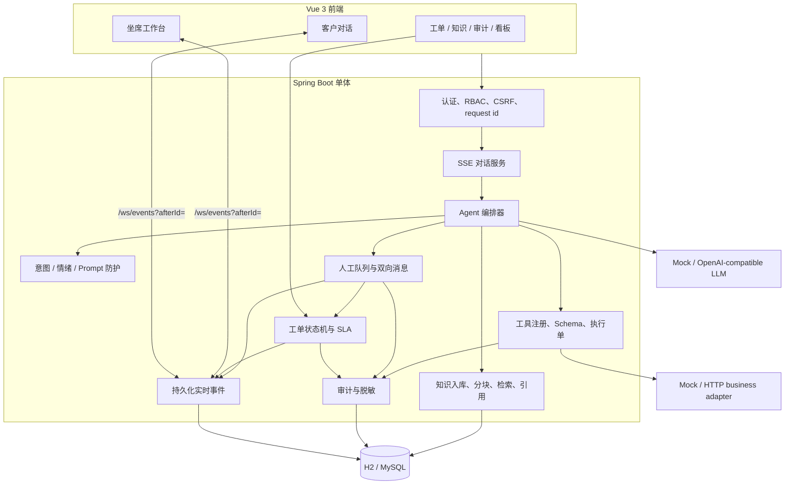
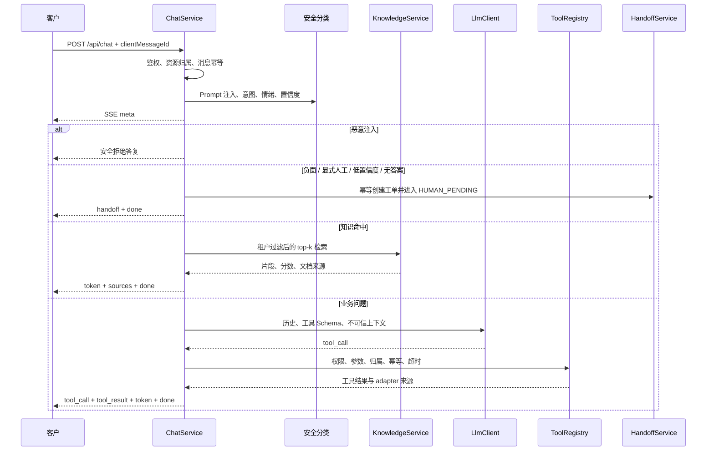
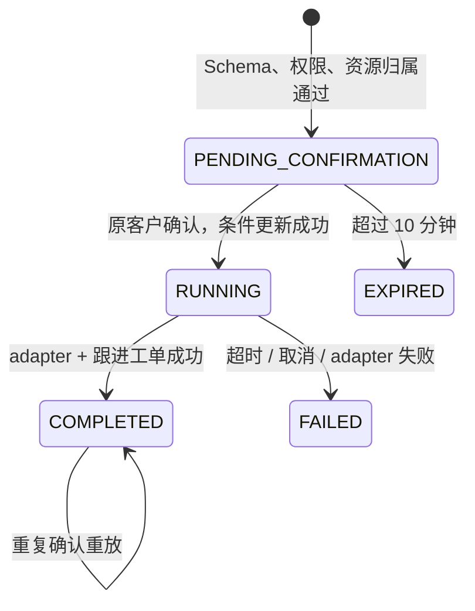
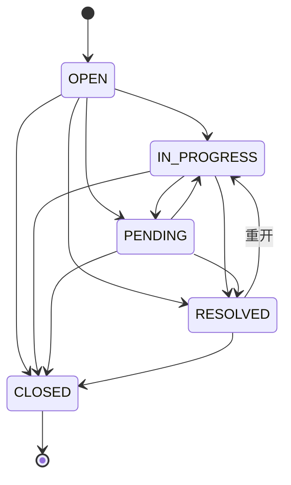

# 架构设计

## 模块边界

项目保持 Spring Boot/Vue 单体，不为作品集场景引入消息队列或微服务。状态先写数据库，再发布可重放事件；WebSocket 不承担业务写入。

## 对话决策链

规则意图/情绪是确定性兜底，输出标签、置信度和分类来源。固定评估集覆盖 38 条对话；当前 Mock 评估工具选择准确率 100%，转人工召回 100%。真实模型输出不能绕过服务端权限、Schema、归属或确认规则。

SSE 请求可取消：连接断开会设置取消令牌，编排器在模型/工具边界检查并停止后续调用。相同 `clientMessageId` 重放已有结果，不重复写消息或调用工具。

## 敏感工具执行单

执行键由租户、客户请求 id、工具名和规范化参数计算。数据库唯一键阻止并发重复创建；确认使用 `PENDING_CONFIRMATION → RUNNING` 条件更新。审计分别记录申请、确认执行、结果、adapter 和耗时。

## 人工接管与实时事件

1. 自动或手动转人工将会话设为 `HUMAN_PENDING`、暂停机器人并创建关联工单。
2. 坐席队列只返回未分配会话；认领使用数据库条件更新，双坐席并发时只有一个成功。
3. 认领与关联工单进入 `IN_PROGRESS` 位于同一事务。
4. 客户和坐席消息都有独立 `clientMessageId`，可读回、标已读并按受众发布事件。
5. 页面断线重连时携带最后事件 `afterId`；服务端先做租户/角色/用户名过滤，再限制重放条数。
6. 坐席可恢复机器人；新的转人工周期会创建新的可认领工单，不复用上一个已解决周期。

## 工单状态机与 SLA

- 每次创建、认领、指派、流转、重开、SLA 预警和 SLA 超时都写 `ticket_event` 与审计。
- `CLOSED` 必须有关闭原因；客户在已解决会话评价会关闭会话和关联工单。
- 默认 SLA：URGENT 15 分钟、HIGH 60、MEDIUM 240、LOW 480；提前 5 分钟预警。
- 扫描任务用 `sla_warning_at/sla_breached_at` 条件更新竞争所有权，并以唯一事件键防止多实例重复升级。

## Adapter 契约

`BusinessSystemAdapter` 的 Mock 与 HTTP 实现共用：订单、物流、保单查询，改期写操作，健康状态和来源标识。HTTP adapter 设置认证 token、超时、有限重试和幂等键；读 404 映射为空结果，写失败不会伪装成功。

`LlmClient` 的 Mock 与 OpenAI-compatible 实现共用规划/流式契约。Mock 仅用于 Demo/CI；真实 provider 缺 key/base/model 会失败，且私网 base URL 默认禁止。

## 数据与指标口径

核心表共 15 张：用户、会话、消息、知识文档/分块、工具执行单、工单/事件、反馈、审计、实时事件与虚构业务表。

看板范围最多 90 天，使用 `Asia/Shanghai` 的左闭右开日期区间：

- 首次响应：会话创建到首条机器人或坐席回复，仅统计已有回复会话。
- 会话解决率：范围内已关闭会话 / 新建会话。
- 转人工率：范围内进入人工队列会话 / 新建会话。
- 工单解决率：范围内 `RESOLVED/CLOSED` 工单 / 新建工单。
- SLA 超时：范围内新建且存在 `sla_breached_at` 的工单数。
- 满意度：范围内有效评分算术平均，空数据为 0。

## 失败语义

- REST 使用真实 HTTP 状态和统一 JSON 错误；每个响应带 request id。
- SSE 在解析/业务失败时返回对应 HTTP 状态和 `event:error`，不返回空 200。
- 真实 adapter 配置错误在启动期失败；运行期超时/5xx 显式失败，不回退 Mock。
- 知识低分不生成幻觉答案，而是进入无答案转人工路径。
