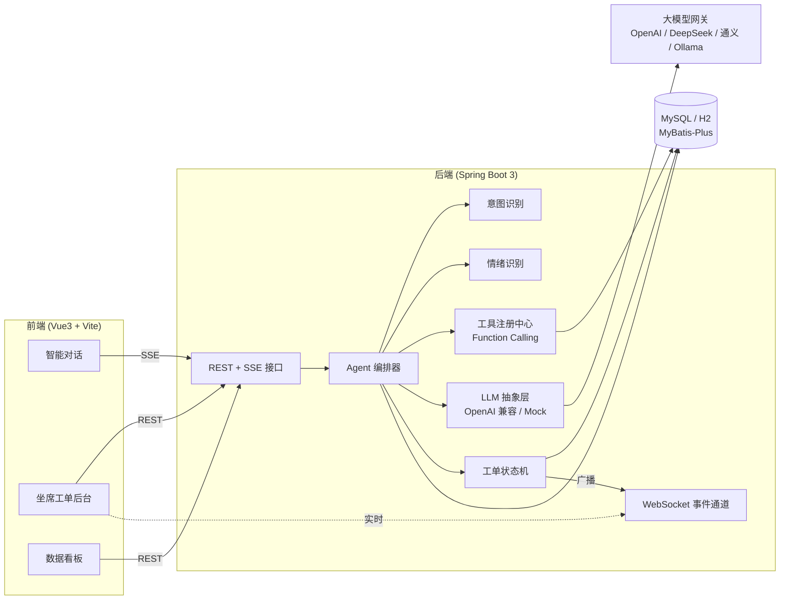
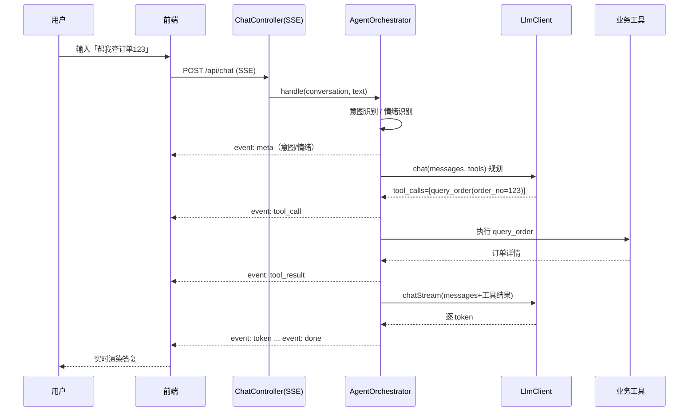
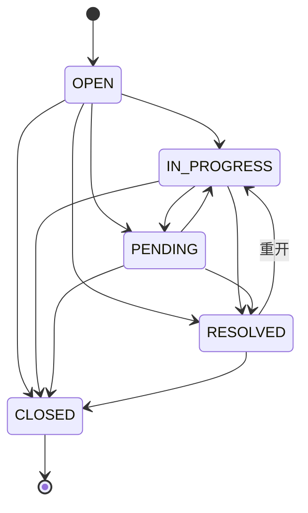

# 架构设计说明

## 1. 总体架构

## 2. 一次对话的处理时序

## 3. 转人工 / 自动升级

- 触发条件：用户显式「转人工」，或情绪识别为负面且负面强度 ≥ 阈值（默认 0.6）。
- 处理：自动创建工单（投诉类为 URGENT/HIGH），会话状态置为 `HUMAN_PENDING`，通过 WebSocket 广播 `ticket.created`，坐席后台实时收到。

## 4. 工单状态机

所有流转都会写入 `ticket_event` 流转记录表，坐席后台以时间线形式展示。

## 5. LLM 可插拔设计

`LlmClient` 接口屏蔽供应方差异：

- `OpenAiLlmClient`：对接任意 OpenAI 兼容 `/chat/completions`，支持 Function Calling 与 SSE 流式。
- `MockLlmClient`：离线内置、规则驱动，无需密钥即可跑通「意图→工具→流式答复」全链路，用于本地体验、单测与 CI。

由 `LlmConfig` 依据 `app.llm.provider` 与是否配置密钥自动选择；未配置密钥时安全回退到 Mock。
